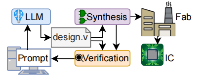

# Chip-Chat: Challenges and Opportunities in Conversational Hardware Design
System-level design

## 基本信息
- **会议**：Workshop on Machine Learning for CAD
- **Title**: Chip-Chat: Challenges and Opportunities
in Conversational Hardware Design
- **发表时间**：22 May 2023
- **作者**：Jason Blocklove, S. Garg, R. Karri, H. Pearce
- **作者单位**: New York University
- **Github**: [https://zenodo.org/records/7953725](https://zenodo.org/records/7953725)

## 摘要
现代硬件设计从以自然语言提供的规范开始。然后，在合成电路元件之前，硬件工程师将这些语言翻译成适当的硬件描述语言 （HDL），例如 Verilog。自动化这种翻译可以减少工程过程中的人为错误来源。但是，直到最近，人工智能 （AI） 才展示了基于机器的端到端设计翻译的能力。OpenAI 的 ChatGPT 和谷歌的 Bard 等商用指令调优大型语言模型 （LLM） 声称能够生成多种编程语言的代码;但仍然缺乏检查它们硬件的研究。因此，在这项工作中，我们探讨了在利用 LLM 的这些最新进展进行硬件设计时面临的挑战和机遇。鉴于这些“对话式”LLM 在交互式使用时表现最佳，我们进行了一个案例研究，其中硬件工程师根据实际硬件约束与 LLM 共同构建了一种基于累加器的新型 8 位微处理器架构。然后，我们将处理器送入 Skywater 130nm 穿梭机中流片，这意味着这种“芯片聊天”产生了我们认为是世界上第一个完全由 AI 编写的用于流片的 HDL。

## 研究背景
- **硬件设计流程**：自然语言需求→人工翻译为Verilog→合成电路，人力密集型且易出错。
- **LLMs进展**：软件领域已广泛应用（如GitHub Copilot），但硬件领域研究滞后，尤其缺乏对话式LLMs（如ChatGPT）的验证。
- **空白领域**：现有ML研究聚焦IC CAD后端（如布局布线），早期HDL编写阶段未涉及。

## 研究动机
- **减少人为错误**：自动化自然语言到HDL的翻译。
- **探索交互式设计**：验证对话式LLMs能否作为硬件工程师的“协同架构师”。
- **突破效率瓶颈**：替代高阶综合工具（如C-to-HDL）的硬件效率损失。

## 主要贡献 & 创新点

- 首次系统研究对话式LLMs（GPT-3.5/GPT-4）在硬件设计中的应用。
- LLM和工程师合作，完成世界首个完全由AI生成HDL并成功tapeout的8位微处理器（Skywater 130nm）。
- 提出实践建议（如分线程交互、早期反馈优化）并开源全流程数据。

## 数据集
案例研究生成的Verilog代码 + 对话日志（125轮交互，18个主题）

## 方法细节

将LLM和工程师配对，共同完成复杂的设计任务，通过定性分析他们在任务中的表现，评估LLM对工程师的帮助。
### 任务分配
- 最终任务：设计一个基于8位计数器的微处理器
- 工程师任务：负责引导LLM和完成测试
- LLM任务：负责生成全部代码

### 对话流程
ISA定义→组件实现→数据路径集成→控制单元→仿真修复→FPGA/ASIC验证。
- 首先定义指令集架构（ISA）
- 然后实现ISA所需的组件
- 最后将这些组件与控制单元结合成数据路径以进行管理。
- 通过模拟和测试来发现并修复错误。

**交互策略**：分11个对话线程（每线程<16k tokens），人工维护“base specification”（由GPT-4生成的关键设计信息，如ISA指令集、寄存器列表、内存定义、ALU功能等，经人工筛选、整合和轻微编辑后形成），传递上下文。

当在使用LLM遇到输出的答案不满意时，有两种重新获取答案的方法：

- 继续对话，并给出引导，提示上一个答案中的优缺点；
- 重新回答。

这两者之间做出选择需要权衡：继续对话可以让用户指出前一个回应中哪些部分是好的或不好的，但会占用有限的上下文空间；但重新生成则会使整个对话更短、更简洁。

<!-- - **工具链**：OpenLane（synthesis）、OpenSTA（static timing and power analysis）、Xilinx Vivado（FPGA）。 -->

## 实验设计
- **评估指标**：
  - 功能正确性（FPGA测试24条指令）
  - 硬件指标（ASIC和FPGA）
  - 设计效率（22.8小时人工+LLM交互）
  
- **研究模型**：GPT-4
- **细节实现**：
  - 人工验证语法/修复bug（如shift寄存器WIDTH=1边界错误）。
  - 拒绝不可靠的LLM测试台，改用人工编写。

### 实验结果

- 对话的结果很大程度上取决于早期的互动：对初始提示和前几次反馈的反应。因此，我们建议评估对早期提示的回应，如果这些回应不令人满意，可以考虑从更早的点重新开始对话。
- 使用CWEAT工具没有发现安全缺陷，表明Verilog代码至少达到了基本的质量标准。这一点尤为重要，因为[16]的研究发现，像GitHub Copilot这样的语言模型会生成这类CWE。

## 讨论 & 不足

虽然LLM生成HDL代码取得了不错的效果，但是这种方法存在不可规避的缺点：
- 可复现性差：ChatGPT-4非确定性+闭源，结果难以完全复现。
- 规模限制：仅8位处理器，未验证复杂设计（如SoC）。
- 可统计性差：未完全自动化处理，所设计的处理器无法提供足够的数据来得出正式的统计结论。
- 验证能力：LLM无法生成有效测试台，测试脚本和测试用例。

## 未来工作
- 开展大规模用户研究（larger user study），量化对话式 LLM 对硬件设计效率的实际提升。
- 开发面向硬件的专用对话式 LLM（conversational LLMs specific to hardware design），以进一步优化设计结果。
