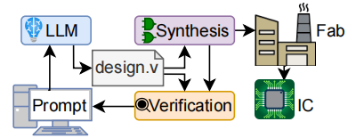

# Chip-Chat: Challenges and Opportunities
in Conversational Hardware Design

## 基本信息
- **会议**：Workshop on Machine Learning for CAD
- **Title**: Chip-Chat: Challenges and Opportunities
in Conversational Hardware Design
- **发表时间**：22 May 2023
- **作者**：Jason Blocklove, S. Garg, R. Karri, H. Pearce
- **作者单位**: New York University
- **Github**: [https://zenodo.org/records/7953725](https://zenodo.org/records/7953725)

## 摘要

现代硬件设计始于自然语言提供的规格。这些规格随后由硬件工程师转换成适当的硬件描述语言HDL），如Verilog，然后进行电路元素的综合。自动化这一转换过程可以减少工程过程中的人为错误。
然而，直到最近，人工智能（AI）才展现出机器端到端设计转换的能力。市面上可用的指令调优大型语言模型（LLM），例如OpenAI的ChatGPT和Google的Bard，声称能够生成多种编程语言的代码；但针对硬件的研究仍然不足。
因此，本研究探讨了利用这些最新的LLM技术在硬件设计中所面临的挑战和机遇。鉴于这些‘对话式’LLM在交互式使用时表现最佳，我们进行了一项案例研究，其中一位硬件工程师与LLM合作，根据实际硬件约束共同设计了一种基于8位累加器的微处理器架构。然后我们将处理器送入Skywater 130nm穿梭机进行带出，这意味着这个“芯片聊天”产生了我们认为是世界上第一个完全由人工智能编写的带出HDL。

## 研究动机
- 传统HDL设计始于自然语言编写的需求规范，将其翻译为Verilog等HDL代码的过程​​耗时且易出错​​。
- 现有替代方案：高级综合工具，使用例如C语言等高级语言来指定功能，但会牺牲硬件效率。
## 主要贡献 & 创新点

- ​首次调查了对话式大语言模型在硬件设计中的应用。（LLM在硬件代码生成领域的应用）。
- 通过使用ChatGPT-4，对复杂硬件应用的端到端协同设计进行了观察研究。（LLM和工程师合作）
- 首次利用AI编写出完整的HDL（硬件描述语言）代码，实现了重大突破。（完成微处理器的设计）
- 提出了实用建议，以有效利用前沿对话式大语言模型于硬件相关任务中。（使用对话式LLM的一些经验方法）

## 数据集

无。

## 模型结构

## 实验方法

将LLM和工程师配对，共同完成复杂的设计任务，通过定性分析他们在任务中的表现，评估LLM对工程师的帮助。
### 任务分配
- 最终任务：设计一个基于8位计数器的微处理器
- 工程师任务：负责引导LLM和完成测试
- LLM任务：负责生成全部代码

### 对话流程
- 首先定义指令集架构（ISA）
- 然后实现ISA所需的组件
- 最后将这些组件与控制单元结合成数据路径以进行管理。
- 通过模拟和测试来发现并修复错误。

对话时采用的思路：将较大的设计拆分为多个子任务，每个子任务在界面上都有自己的‘对话线程’，在需要更新设计时，会继续之前的对话线程。

当在使用LLM遇到输出的答案不满意时，有两种重新获取答案的方法：

- 继续对话，并给出引导，提示上一个答案中的优缺点；
- 重新回答。

这两者之间做出选择需要权衡：继续对话可以让用户指出前一个回应中哪些部分是好的或不好的，但会占用有限的上下文空间；但重新生成则会使整个对话更短、更简洁。

### 实验结论和启示

- 对话的结果很大程度上取决于早期的互动：对初始提示和前几次反馈的反应。因此，我们建议评估对早期提示的回应，如果这些回应不令人满意，可以考虑从更早的点重新开始对话。
- 使用CWEAT工具没有发现安全缺陷，表明Verilog代码至少达到了基本的质量标准。这一点尤为重要，因为[16]的研究发现，像GitHub Copilot这样的语言模型会生成这类CWE。
- LLM对设计帮助很大，但是对于测试过程帮助不大，无法生成合理的测试平台，测试脚本和测试用例
## 讨论 & 不足

虽然LLM生成HDL代码取得了不错的效果，但是这种方法存在不可规避的缺点：
- 可复现性差：由于测试的对话式大语言模型是非确定性和生成性的，因此其输出结果难以一致地重现。ChatGPT是闭源且远程运行的，我们无法检查模型参数或分析输出生成的方法。这些测试的对话性质增加了可重复性的难度，因为每次用户回应都依赖于前一个模型的响应，因此细微的变化可能会导致最终设计的重大差异。
- 可统计性差：由于本研究的目标是设计硬件对话系统，因此我们没有对这一过程的任何部分进行自动化处理，每次对话都需要手动完成。这不仅限制了实验规模，还受到速率限制和模型可用性（撰写本文时，OpenAI的ChatGPT-4访问权限仍然有限）的影响。因此，所设计的处理器可能无法提供足够的数据来得出正式的统计结论。

## 未来工作
