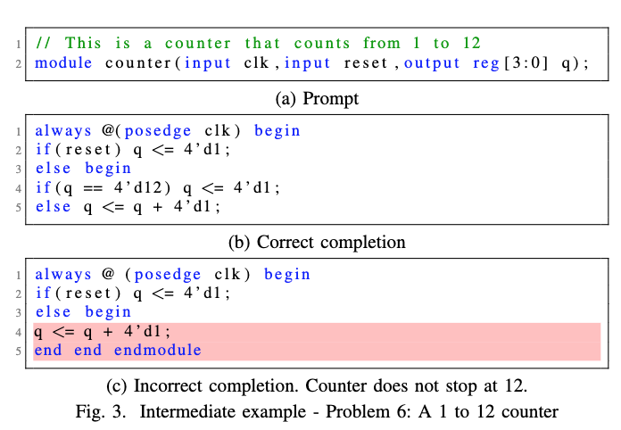

# VeriGen: A Large Language Models for Verilog Code Generation

## 基本信息
- **会议**：Design, Automation & Test in Europe Conference (DATE 2023). CCF-B Best Paper Award Candidate
- **期刊**：Design, Automation and Test in Europe. CCF-B. 
- **Title**: [Benchmarking Large Language Models for Automated Verilog RTL Code Generation](https://export.arxiv.org/pdf/2212.11140v1.pdf). 和VeriGen基本是同一篇工作，这个是VeriGen的数据集专门的文章。
- **发表时间**：2022/2023
- **作者**：Shailja Thakur, Baleegh Ahmad, Hammond Pearce, Benjamin Tan, Brendan Dolan-Gavitt, Ramesh Karri
- **作者单位**: New York University
- **Github**: [https://github.com/shailja-thakur/VGen](https://github.com/shailja-thakur/VGen)

## 简介
VeriGen: A Large Language Models for Verilog Code Generation 
和 
Benchmarking Large Language Models for Automated Verilog RTL Code Generation 
这两篇工作基本一样，前者是在后者的基础上完善了更多的实验，以及更多的实验细节

## 摘要

自动化硬件设计可以消除工程过程中大量的人为错误，减少错误。

Verilog是一种流行的硬件描述语言，用于建模和设计数字系统，因此生成Verilog代码是关键的第一步。

新兴的大型语言模型（LLM）能够用其他编程语言编写高质量的代码。

在本文中，我们描述了LLM生成有用Verilog的能力。为此，我们对从GitHub和Verilog教科书收集的Verilog数据集上的预训练LLM进行了微调。我们构建了一个评估框架，其中包括用于功能分析的测试台和一个流程，用于测试为应对不同难度的问题而生成的Verilog代码的语法。我们的研究结果表明，在我们的问题场景中，微调使LLM更有能力生成语法正确的代码（总体为25.9%）。
经过微调的CodeGen可以胜过最先进的GPT-3.5-turbo和CodeX。

## 主要贡献 & 创新点

- 训练数据集：使用Google BigQuery从GitHub上的开源Verilog代码库中收集数据，并使用Python工具从教科书PDF中提取文本，然后进行清洗和预处理，创建了一个大规模的Verilog代码训练语料库。
- 大规模实证研究：使用上述语料库对五个不同参数规模的预训练LLMs进行微调，以生成专门针对Verilog的模型，并研究了不同参数（温度/采样数量）对生成代码的影响。
- 设计评估benchmark：设计了一组具有不同难度级别的Verilog编码问题，并为每个问题编写了测试用例，以测试生成代码的功能正确性。

## 数据集

- 数据集是作者自己构建的，主要来自两部分。
1. 来自Github
   - 通过github搜索verilog相关的repo
   - 取重 by mhd5
    - 保留.v的后缀文件
    - 过滤较大的文件
    - 最终保留下来大约50K的文件 大小大约300MB
2. 来自verilog 相关的书籍
    - 下载相关pdf
    - 剔除不相关段落
    - 通过正则提取相关代码

- 通过上述两种方式提取到代码段之后，通过滑动窗口的方式构造训练样本。整体的语料库大小大约为400MB。

数据集下载链接：https://huggingface.co/datasets/shailja/Verilog_GitHub
来自HaggingFace，大约1.8GB

- 测试benchmark（VGen）
https://github.com/shailja-thakur/VGen/tree/main/prompts-and-testbenches

## 模型结构

作者对比了多种不同的LLM结构，不同的层数、head个数和
embedding的大小如下表所示。其中code-davinci-002来自GPT-3，没有开源，所以不知道网络结构。

## 实验结果

### 实验设置

作者将所有数据按照难易程度划分为17个类别，三个难易程度（basic、intermediate、advanced）

- 其中简单的任务如下所示，其中prompt包括了module的输入定义、通过注释定义了函数的功能，当前sample的功能是输出3bit的最高位bit。下同。
   
- 中等的任务如下所示，需要实现的功能是计数器，从1到12
   
- 困难的任务如下所示
   

### 实验参数

1. Prompt: 整体包括low、medium、high三种等级的prompt。随着等级的提高，prompt里包含的细节也越来越多。如下图所示。

2. Sampling Temperature: {0.1, 0.3, 0.5, 0.7, 1.0}
3. Completions Per Prompt: {1, 10, 25}
4. Max tokens: 300

### 实验结果

- 实验指标：Pass@k（论文中设置为k=10），代表前k个候选集中有没有代码可以pass，这里的pass定义有两种：编译通过 或者 通过单元测试。

作者通过实验主要回答了四个问题
1. 基础的LLM（未经SFT）在verilog上生成效果如何
2. 经过SFT的LLM是否改善代码生成的效果
3. 大的LLM模型是否可以取得更好的效果
4. 问题描述的变化是否影响正确答案的质量和数量

基本的实验结果如下表格所示，可以看到没有经过SFT的LLM表现基本都很差，接近0。经过SFT后的模型，表现有了很大的提升。

除此之外，作者也验证了Prompt的质量会影响指标，Prompt描述的越详细，最终生成的代码质量越好。

## 讨论 & 不足

虽然SFT取得了不错的效果，但是针对某几类问题还是表现不好，作者归纳总结了以下几点原因
1. 需要更高质量的prompt
2. 训练的语料需要更加丰富

## 未来工作

- **更大规模的数据集**：尽管论文中使用了GitHub和教科书中的数据来构建训练语料库，但扩展数据集的规模和多样性可能会进一步提高LLMs的性能和泛化能力。
  
- **更复杂的测试用例**：论文中提到测试台对于更复杂的问题只能覆盖部分行为。开发更全面的测试台和测试案例，特别是对于高级问题，可以更准确地评估生成代码的功能正确性。

- **跨领域迁移学习**：探索LLMs在从一种编程语言（如Python或C）到另一种（如Verilog）的迁移学习中的性能，以及如何优化这一过程。