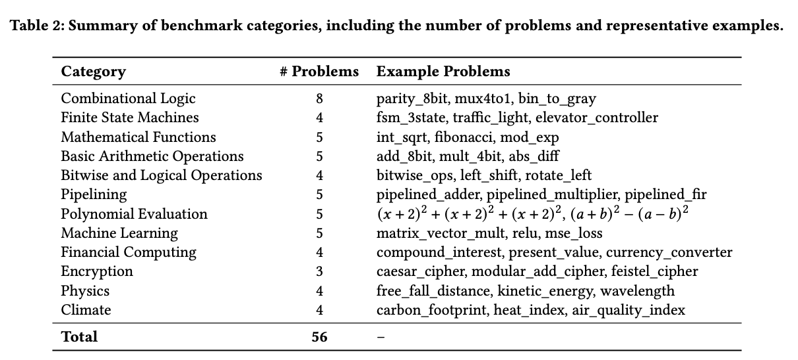
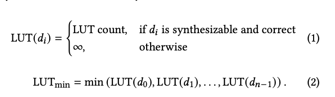
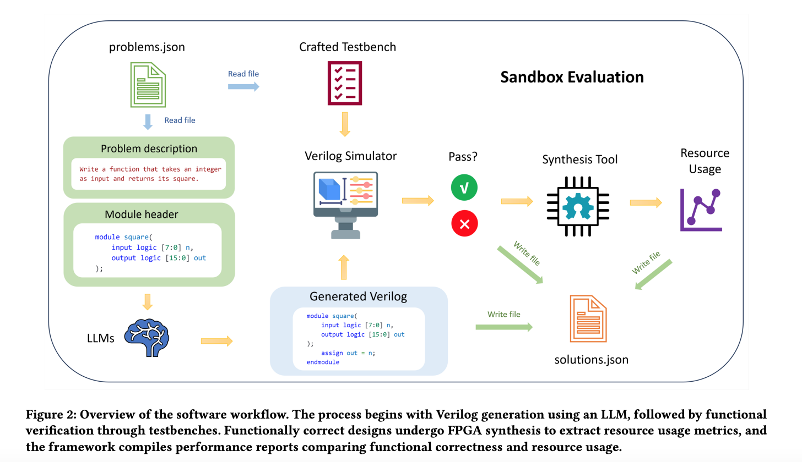
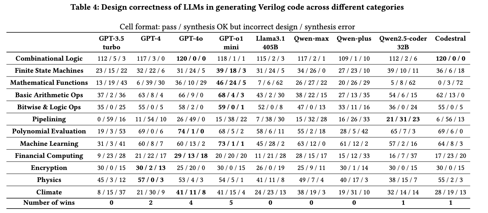
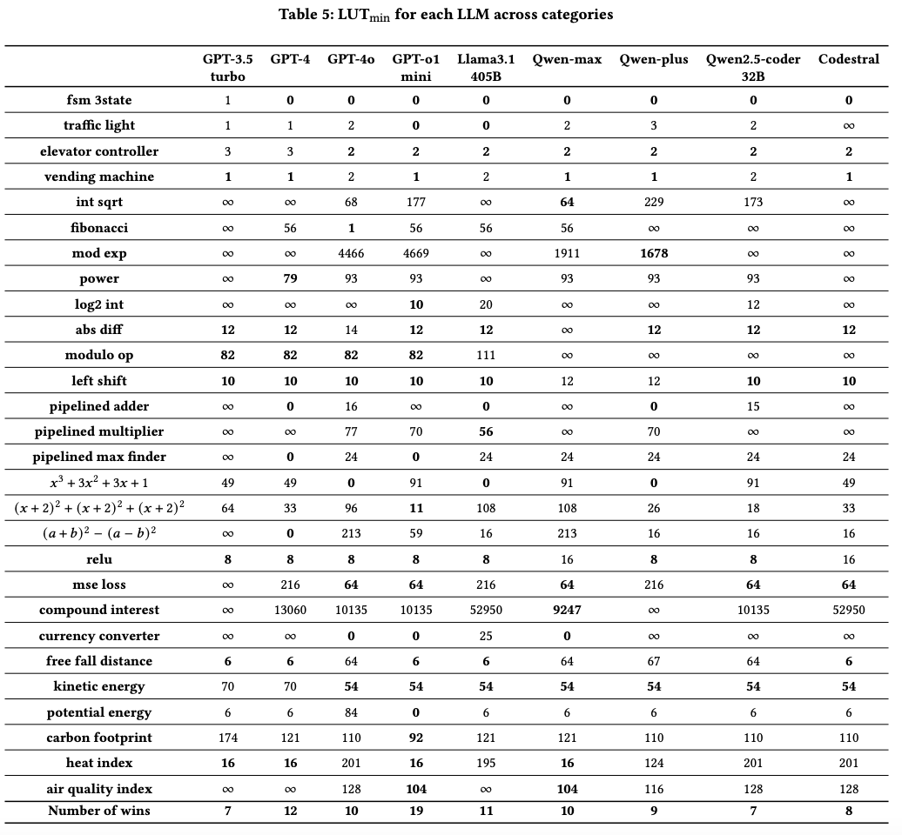

# ResBench: Benchmarking LLM-Generated FPGA Designs with Resource Awareness

## 基本信息
- **会议/期刊**： International Symposium on Highly Efficient Accelerators and Reconfigurable Technologies, 2025
- **Title**: [ResBench: Benchmarking LLM-Generated FPGA Designs with  Resource Awareness](https://arxiv.org/pdf/2503.08823)
- **发表时间**：2025
- **作者**：Ce Guo, Tong Zhao
- **作者单位**: Imperial College London United Kingdom
- **Github**: [https://github.com/jultrishyyy/ResBench](https://github.com/jultrishyyy/ResBench)

## 背景
FPGA已经广泛应用到硬件设计领域，但是编写硬件设计语言（HDL）还是一个劳动密集（labor-intensive）型的任务。并且还需要大量的时间来验证是否有无错误。

现阶段已经有许多研究开始尝试将LLM应用到HDL的编写当中，帮助工程人员提高工作效率。这些工作主要关注的是生成代码是否正确，例如是否通过测试用例。

但是HDL和其他编程语言有一个很大的不同，就是HDL语言很注重资源高效，因此本文提出了一个数据集专门用于验证LLM生成的Verilog代码资源利用是否高效。

## 主要贡献

1. 一个可以较为全面验证资源利用情况的数据集

2. 一个可以全自动化评估资源利用的方法/代码

3. 详细的性能分析

## 数据集详情

### 设计的原则

- 资源利用率的不同：确保同一个问题对LLM来说有多种解法，这样子才能体现LLM生成的代码效果好坏。如果只有一种写法，那么突出不了LLM效果之间的优劣。

- 应用的多样性：确保应用场景的广泛性，确保可以体现FPGA使用的真实场景

### 数据集

- 整个数据集一共包括56个问题，由12个类别组成。每个类别的问题个数分布在3-8之间。

- 数据集的两个特性：关注的资源高效和问题的多样性。

- 数据集里的每个样本包括：
    - 针对问题的自然语言描述
    - 标准的verilog module定义，相当于 function name定义
    - 预先定义好的test bench
## 实验结果

### 评估指标

1. 资源评估指标：LUT
    
- 选择LUT作为资源的评价指标，原因：LUT是评估FPGA资源是否高效利用的基础指标，LUT=lookup table, 有点像缓存？FPGA也有其他资源类型，例如FSP BRAM，Flip-Flops但是这些指标大多和任务相关，不够通用，所以最终选择LUT作为资源是否高效的评价指标

- lut最终使用量的计算公式如下图所示

2. 正确性评估指标：Pass@K

### 评估流程

整体的评估流程如下图所示。

### 实验结果

1. 正确性上评估

从正确性上评估来看，冠军、亚军分别是gpt-O1 mini和gpt 4o，结果如下表所示。
其中A/B/C分别表示正确的/生成OK但是错误设计/生成错误。因为每个问题都跑了15次，所以针对第一大类一共8个问题，相当于一共8*15=120个sample。

gpt-o1 赢下了12个大类中的5个，gpt 4o赢下了4个，gpt 4赢下了2个。

2. 资源角度评估

**为啥选择了这26个问题，没有解释文中**

从资源利用高效角度来看，冠军、亚军分别是gpt-O1 mini和llama 3.1 405B

## Future Work

1. 扩展更大的数据集
2. 增加sequential designs， such as pipelined architectures and state-driven circuits. **不太懂，是不是需要硬件设计经验**
3. 支持多种HDL，不仅局限于verilog